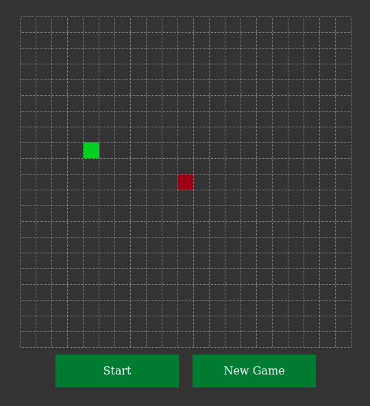

# snakeGame.js

Simple implementation of the Snake game with JavaScript, HTML and CSS. No levels and ratings, only gameplay.

## Controls

* `UP_ARROW` - move up
* `DOWN_ARROW` - move down
* `LEFT_ARROW` - move left
* `RIGHT_ARROW` - move right

## Interface buttons

You'll see few buttons, which you can use to control the game events.

### Start

Press `Start` to start the game.

### New game

The `New Game` button change the snake's and food's starting positions at the field.
Also it restarts the game.

### Stop

Press `Stop` while you're playing to switch the game in pause.

### Game Over

If your snake has faced with the barrier, press `Game Over` button to restart.
